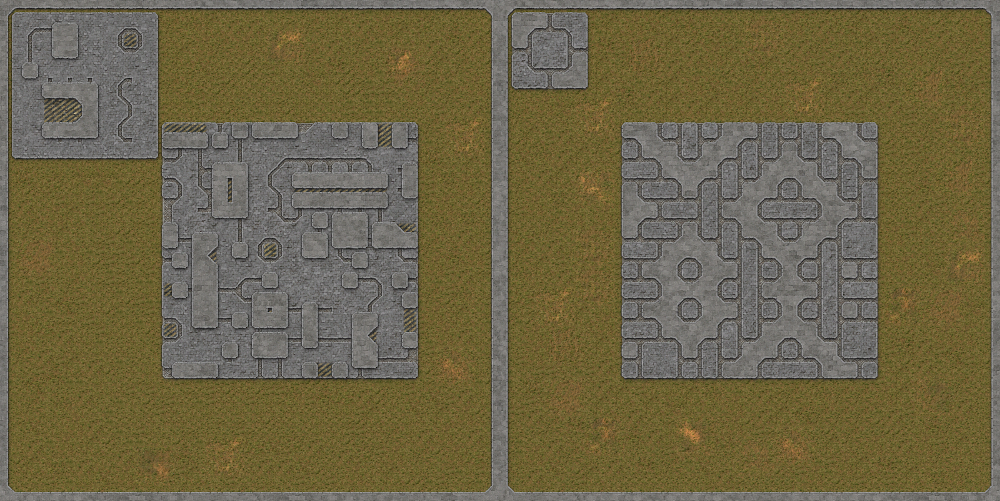
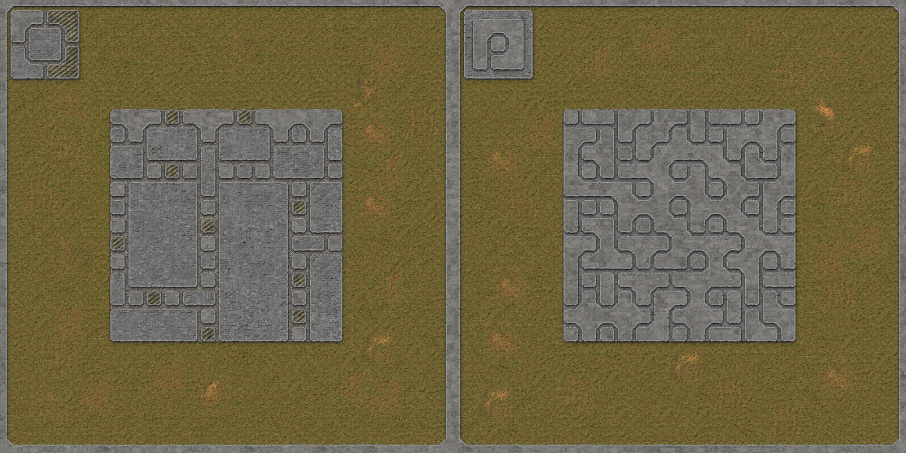
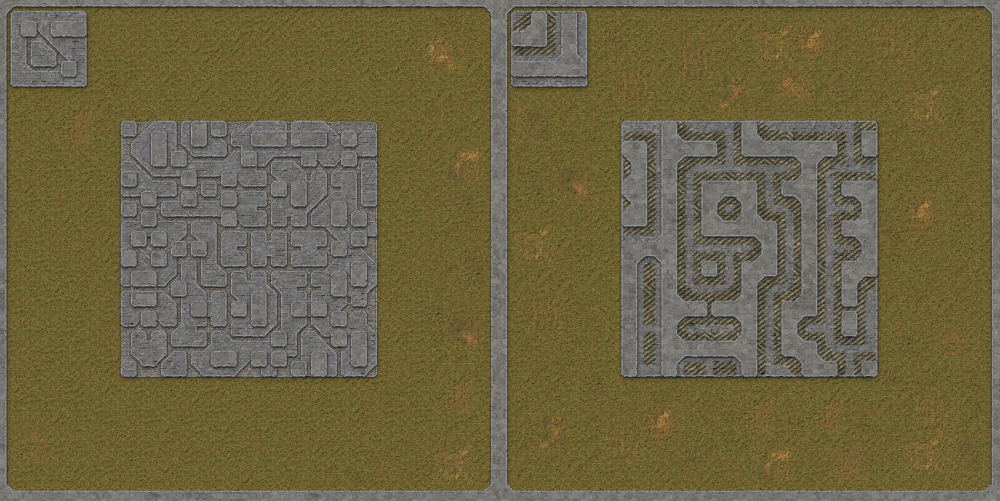
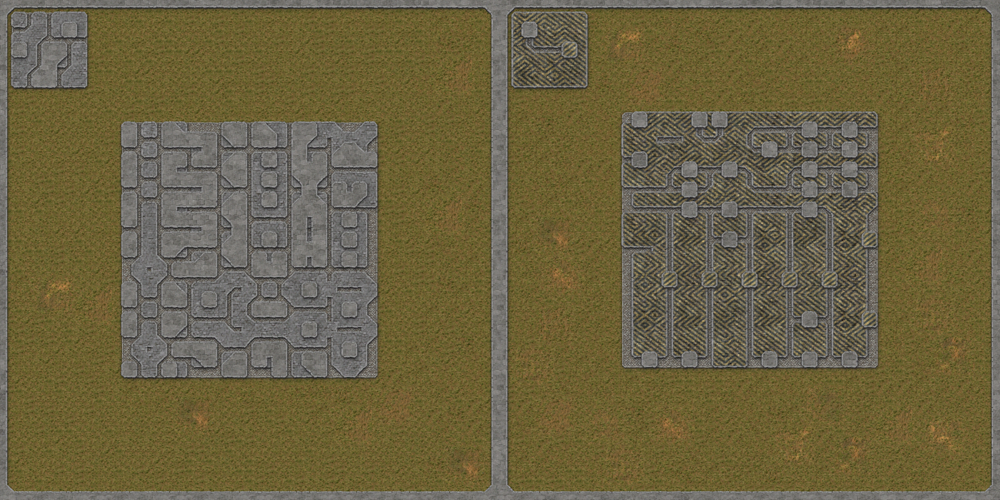
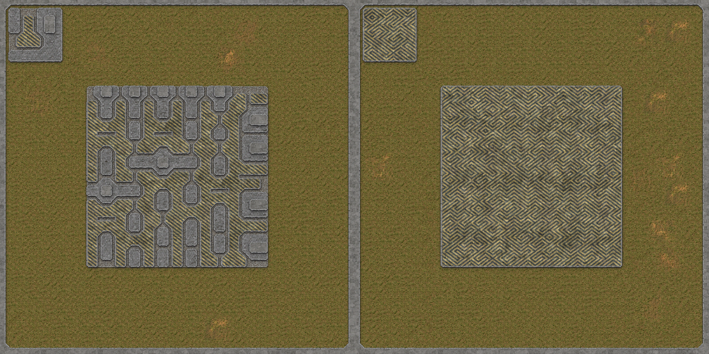
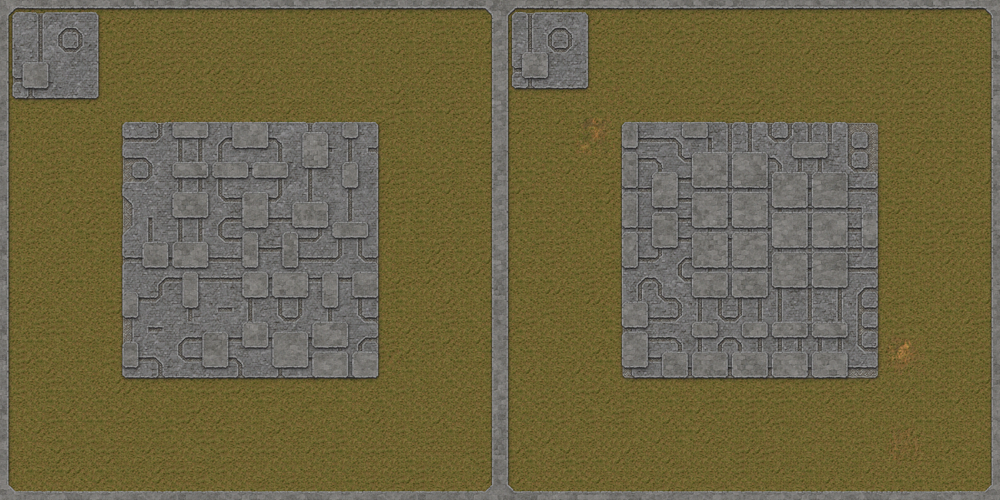
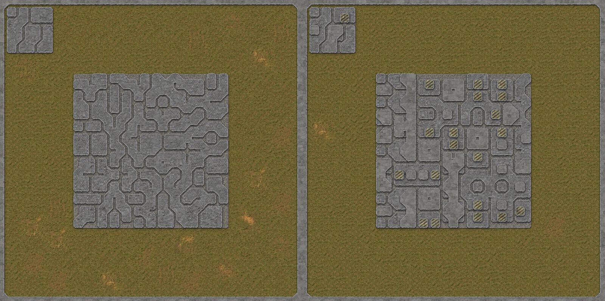
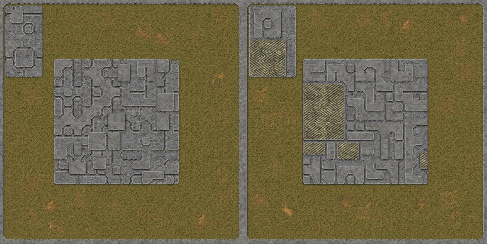
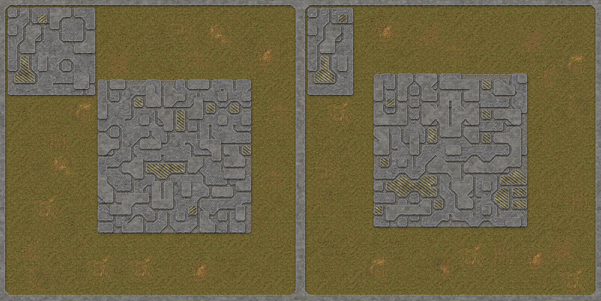
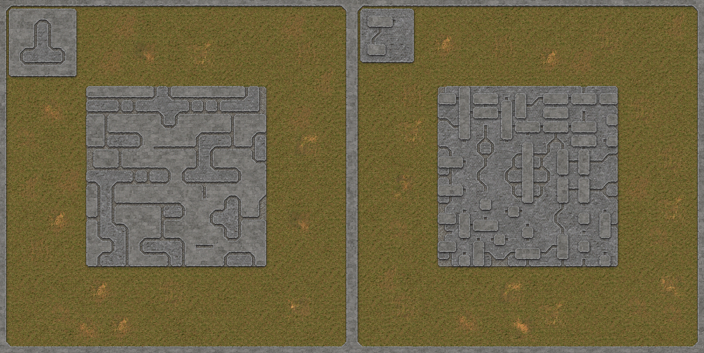

# Factorio greeble
Factorio mod for base decoration. Uses chunked WFC algorithm to fill area with tile patterns based on input sample. 

> Special thanks to [LeonSkills](https://github.com/LeonSkills) for help with initial boilerplate

> [!CAUTION]
> Mod is currently in testing and designed to work in editor mostly, not in game

# Examples

<video width="640" height="480" controls>
  <source src="public/screenshots/greeble_small.webm" type="video/mp4">
  Your browser does not support the video tag.
  see video in public/screenshots
</video>

 
    
 
        More screenshots
    

    Left top - input sample, center - generated output

|  |   |
| :---------------------------: | :----------------------------: |
|  |   |
|  |   |
|  |   |
|  |   |

# Usage
`Alt+P` to get greeble tool in you hand
`LMB` select area to grab sample
`RMB` select area to fill
`Shift+RMB` select area to render tiles extracted from sample

# Mod settings

- `Tile size` - default is 3x3, defines how many different pieces will be made from initial sample (if you have 5x5 sample with 3x3 tile it will try to extract 9 tiles from it). Bigger tiles keep more similarity to initial sample but require much more careful sample design, smaller tiles are easier to work with
- `Chunk size` - default is 3x3 tiles (so 9x9 in-game tiles if `overlap` is false or 7x7 if `overlap` is true). Smaller chunks have less FPS\UPS impact but could get stuck easier on some samples
- `Spread tiles` - mainly for debug, result blocks will be rendered 1 tile apart to check if they match correctly
- `Overlap tiles` - if two blocks (let's say 3x3 each) match it will remove the duplicate producing 5x3 tiles instead of 6x3 with middle being duplicated
- `Include rotations` - should each tile produce rotated copies when input sample is analyzed (better generation stability if true, result is less "similar" to initial sample)
- `Include mirrored tiles` - similar to `Include rotations`, produces more variations for generation
- `Skip intermediate` - treat initial sample as itself composed of tiles and use less pieces  (better generation stability if false, less "similar" to initial sample) (if you have 5x5 sample with 3x3 tile it will try to extract only 4 tiles from it)
- `Grid size` - mainly for debug, currently ignored
- `Attempts limit` - total attempts to solve individual chunks, default is 2k. 10k is the limit for it now during testing
- `Attempts per tick` - attempts to solve chunks per tick, decrease if FPS drops too much during generation
- `Avoid buildings` - NOT IMPLEMENTED YET - won't place generated greeble under buildings (default is true and buildings are padded with `refined-concrete`)
- `Outline buildings` - NOT IMPLEMENTED YET - will make a border around buildings (default is true and buildings are outlined with `stone-path`)
- `Import as tiles` - NOT IMPLEMENTED YET - will be using input as is without analyzing it 
- `Preserve existing tiles` - should be working already but not sure, default is true

# Future
- [ ] GUI
    - [ ] Select underlying tiles for entities
- [x] Import as tiles 
- [ ] WFC
    - [ ] Sparse templates
- [ ] Code cleanup
# Notes
- Mod is currently in testing and designed to work in editor mostly, not in game

# Developer Notes
(in case you decide to dive into the source)
- code is garbage on the day of publishing
- main algorithm is in [wfc_chunks]('/pattern_gen/wfc_chunks.lua')
- every frame N attempts to solve a chunk is made until attempts limit reached or every chunk is collapsed
- backtracking is not efficient, see `backtrackAmount`

# Additional
![Celtic tileset blueprint] https://factoriocodex.com/blueprints/226